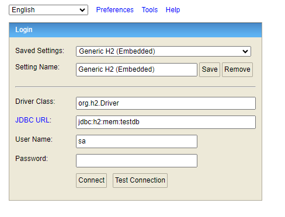

# micro-price
Este proyecto da solución a la prueba planteada en el README [TESTJAVA-2020](documentacion/TestJava2020.md).

Se agrega una bateria de pruebas de **POSTMAN**, se puede descargar el archivo aquí [test-collection](documentacion/Test-Java-2020.postman_collection.json)

# Descripción
El proyecto fue creado mediante la metodología `Api First` por tal motivo cuenta con dos módulos de Maven.

En el módulo [service-api](micro-price-service-api/) se cuenta con la configuración para mediante un archivo `SWAGGER` se generan los modelos y las interfaces con la configuración de los endpoints.

En el módulo [service-rest](micro-price-service-rest/) se cuenta con toda la lógica de negocio, conexión a la base de datos y la batería de test unitarios.

Una vez se ejecuta el proyecto se puede acceder al `swagger` desde el link [Price Api](http://localhost:8080/swagger-ui/index.html).

Se puede acceder a la basde de datos H2 desde el link [db-h2](http://localhost:8080/h2-console) con los datos de acceso.
```
Class:  org.h2.Driver
URL:    jdbc:h2:mem:testdb
User:   sa
```
## Ejemplo


# Deuda Técnica

1. Se pasa la hora mediante un parametro, para que en el caso que no se envie una hora se tome la hora del sistema, esto queda sujeto a valoración.

2. Si el formato de la hora enviada no es correcto se toma la hora del sistema, donde se esperan los formatos `HH:mm` o `HH:mm:ss`, se debe confirmar si esta bien o se debe retornar un error.

3. Pendiente de manejo de `logs`, mensajes de errores personalizados.

4. Se puede ver la forma de hacer una refactorización a los test unitarios, agregando más validaciones `asserts` y nuevos casos posibles.


